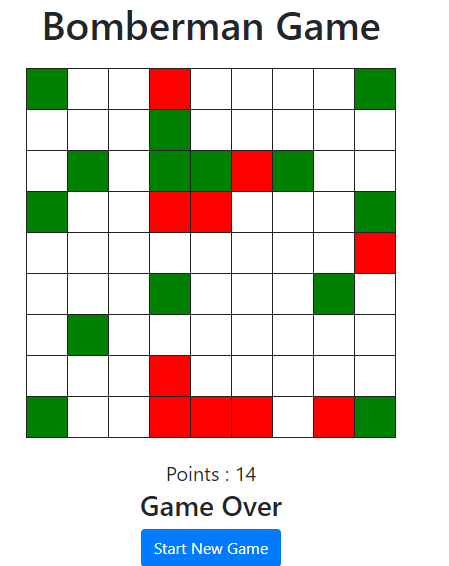

# Bomberman

## You have a 9*9 grid which makes a total of 81 boxes. Out of these 81 boxes 10 boxes contain bomb and other boxes are normal. If a normal box is clicked, the user is awarded a point and if a user clicks on a box containing a bomb, the game gets over (GAME OVER!) and you need to give an option to the user to start a fresh game.

